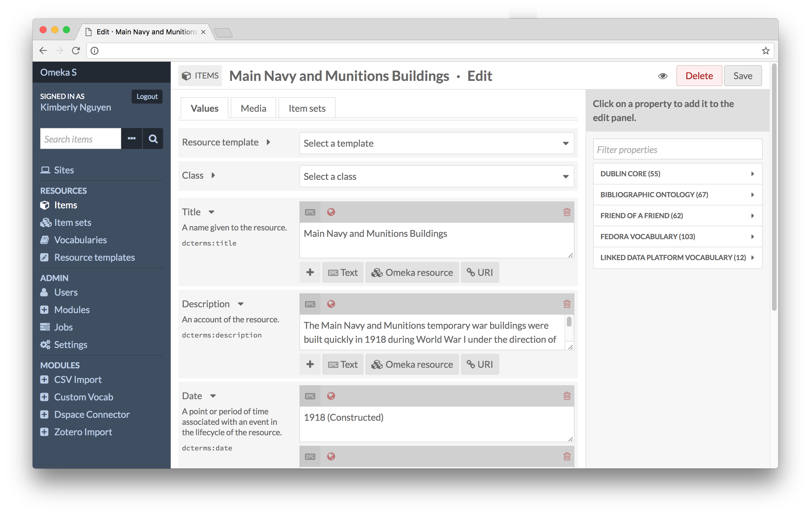

<!--
N.B.: This README was automatically generated by https://github.com/YunoHost/apps/tree/master/tools/README-generator
It shall NOT be edited by hand.
-->

# Omeka S for YunoHost

[](https://dash.yunohost.org/appci/app/omeka-s)    
[](https://install-app.yunohost.org/?app=omeka-s)

*[Lire ce readme en français.](./README_fr.md)*

> *This package allows you to install Omeka S quickly and simply on a YunoHost server.
If you don't have YunoHost, please consult [the guide](https://yunohost.org/#/install) to learn how to install it.*

## Overview

Omeka S is a web publication system for universities, galleries, libraries, archives, and museums. It consists of a local network of independently curated exhibits sharing a collaboratively built pool of items, media, and their metadata.

### Features

- Connect to the semantic Web
- Share with DPLA

**Shipped version:** 3.1.1~ynh1

**Demo:** https://omeka.org/s/download/#sandbox

## Screenshots



## Documentation and resources

* Official app website: https://omeka.org/s/
* Official user documentation: https://omeka.org/s/docs/user-manual/
* Upstream app code repository: https://github.com/omeka/omeka-s
* YunoHost documentation for this app: https://yunohost.org/app_omeka-s
* Report a bug: https://github.com/YunoHost-Apps/omeka-s_ynh/issues

## Developer info

Please send your pull request to the [testing branch](https://github.com/YunoHost-Apps/omeka-s_ynh/tree/testing).

To try the testing branch, please proceed like that.
```
sudo yunohost app install https://github.com/YunoHost-Apps/omeka-s_ynh/tree/testing --debug
or
sudo yunohost app upgrade omeka-s -u https://github.com/YunoHost-Apps/omeka-s_ynh/tree/testing --debug
```

**More info regarding app packaging:** https://yunohost.org/packaging_apps