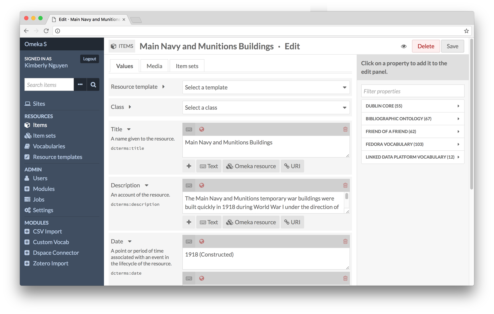

<!--
NB: Deze README is automatisch gegenereerd door <https://github.com/YunoHost/apps/tree/master/tools/readme_generator>
Hij mag NIET handmatig aangepast worden.
-->

# Omeka S voor Yunohost

[](https://ci-apps.yunohost.org/ci/apps/omeka-s/)  

[](https://install-app.yunohost.org/?app=omeka-s)

*[Deze README in een andere taal lezen.](./ALL_README.md)*

> *Met dit pakket kun je Omeka S snel en eenvoudig op een YunoHost-server installeren.*  
> *Als je nog geen YunoHost hebt, lees dan [de installatiehandleiding](https://yunohost.org/install), om te zien hoe je 'm installeert.*

## Overzicht

Omeka S is a web publication system for universities, galleries, libraries, archives, and museums. It consists of a local network of independently curated exhibits sharing a collaboratively built pool of items, media, and their metadata.

### Features

- Connect to the semantic Web
- Share with DPLA

**Geleverde versie:** 4.1.1~ynh2

**Demo:** <https://omeka.org/s/download/#sandbox>

## Schermafdrukken



## Documentatie en bronnen

- Officiele website van de app: <https://omeka.org/s/>
- Officiele gebruikersdocumentatie: <https://omeka.org/s/docs/user-manual/>
- Upstream app codedepot: <https://github.com/omeka/omeka-s>
- YunoHost-store: <https://apps.yunohost.org/app/omeka-s>
- Meld een bug: <https://github.com/YunoHost-Apps/omeka-s_ynh/issues>

## Ontwikkelaarsinformatie

Stuur je pull request alsjeblieft naar de [`testing`-branch](https://github.com/YunoHost-Apps/omeka-s_ynh/tree/testing).

Om de `testing`-branch uit te proberen, ga als volgt te werk:

```bash
sudo yunohost app install https://github.com/YunoHost-Apps/omeka-s_ynh/tree/testing --debug
of
sudo yunohost app upgrade omeka-s -u https://github.com/YunoHost-Apps/omeka-s_ynh/tree/testing --debug
```

**Verdere informatie over app-packaging:** <https://yunohost.org/packaging_apps>
